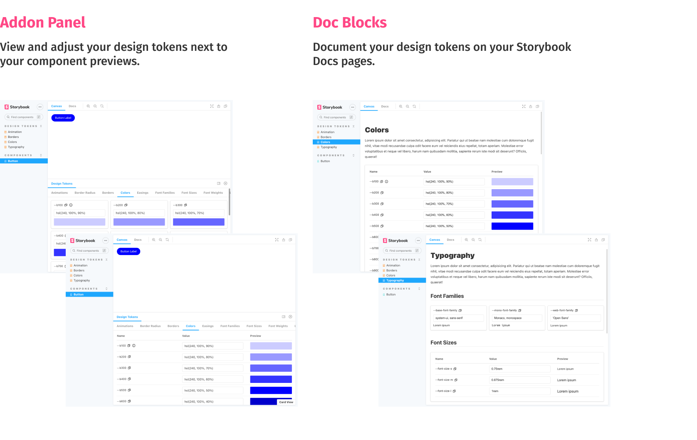

⚠️ **This is the documentation for v4 which supports Storybook v9 and newer. Please check the v3 branch for the release supporting Storybook v7 and v8.** ⚠️

# Storybook Design Token Addon

[](https://app.netlify.com/sites/storybook-design-token-v1/deploys)

Display design token documentation generated from your stylesheets and icon files. Preview design token changes in the browser. Add your design tokens to your Storybook Docs pages using the custom Doc Blocks.

**[Show me the demo](https://storybook-design-token-v1.netlify.app/?path=/docs/demo--docs)**



**Contents:**

- [Storybook Design Token Addon](#storybook-design-token-addon)
  - [Get started](#get-started)
  - [Available presenters](#available-presenters)
  - [Advanced configuration](#advanced-configuration)
    - [Default tab](#default-tab)
    - [Visible tabs](#visible-tabs)
    - [Style injection](#style-injection)
    - [Disable the addon panel](#disable-the-addon-panel)
    - [Token search visibility](#token-search-visibility)
    - [Pagination](#pagination)
    - [Specify a custom glob for your token files](#specify-a-custom-glob-for-your-token-files)
  - [Design Token Doc Block](#design-token-doc-block)
    - [Custom Presenters](#custom-presenters)
    - [Custom filters](#custom-filters)
  - [Browser support](#browser-support)

## Get started

First, install the addon.

```sh
$ yarn add --dev storybook-design-token
# or
$ npm add --save-dev storybook-design-token
```

Add the addon to your storybook addon list inside `.storybook/main.js`:

```javascript
module.exports = {
  addons: ['storybook-design-token']
};
```

The last step is to annotate your design tokens with a category name and a presenter. You can do this by adding special comment blocks to your stylesheets. Below is an example of a css stylesheet defining three categories ("Animations", "Colors", "Others"). It works the same way for scss and less files.

```css
:root {
  /**
  * @tokens Animations
  * @presenter Animation
  */

  --animation-rotate: rotate 1.2s infinite cubic-bezier(0.55, 0, 0.1, 1);

  /**
  * @tokens Colors
  * @presenter Color
  */

  --b100: hsl(240, 100%, 90%); /* Token Description Example  @presenter Color */
  --b200: hsl(240, 100%, 80%);
  --b300: hsl(240, 100%, 70%);

  /**
  * @tokens Others
  */
  --border-normal: 3px dashed red; /* Token Description Example @presenter BorderRadius */
}
```

The presenter controls how your token previews are rendered. See the next section for a complete list of available presenters. You can omit the presenter definition if you don't want to render a preview or no presenter works with your token.

By default, a token category ends with the comment block of the next category. If you want to end a category block before the next category comment, you can insert a special comment to end the block early:

```css
/**
  * @tokens-end
  */
```

To list your svg icons, the addon parses your svg files searching for svg elements. **Important: Only svg elements with an `id` or `data-token-name` attribute are added to the token list.** You can provide descriptions and category names for your icons using the (optional) attributes `data-token-description` and `data-token-category`.

## Available presenters

Please check the **[demo](https://storybook-design-token-v1.netlify.app/?path=/story/components-button--button)** to see the presenters in action.

- Animation
- Border
- BorderRadius
- Color
- Easing
- FontFamily
- FontSize
- FontWeight
- LetterSpacing
- LineHeight
- Opacity
- Shadow
- Spacing

## Advanced configuration

### Default tab

You can specify the default tab shown in the addon panel. Set it to the corresponding category name.

`.storybook/preview.js`

```javascript
export default {
  parameters: {
    designToken: {
      defaultTab: 'Colors'
    }
  }
};
```

### Visible tabs

If you don't want to show all available tabs, it is possible to specify which tabs should be shown in the addon panel via the `tabs` setting.

```javascript
export default {
  parameters: {
    designToken: {
      tabs: ['Colors']
    }
  }
};
```

### Style injection

To inject styles needed by your design token documentation, use the `styleInjection` parameter. A typical usecase are web fonts needed by your font family tokens. Please note that the styleInjection parameter only works with valid css.

`.storybook/preview.js`

```javascript
export default {
  parameters: {
    designToken: {
      styleInjection:
        '@import url("https://fonts.googleapis.com/css2?family=Open+Sans&display=swap");'
    }
  }
};
```

### Disable the addon panel

In some cases you might only want to use the Doc Blocks and hide the addon panel. You can do so by the setting the `disable` parameter:

```javascript
export default {
  parameters: {
    designToken: {
      disable: true
    }
  }
};
```

### Token search visibility

In some cases you might not need the search field to be visible. You can control its visibility by the setting the `showSearch` parameter:

```javascript
export default {
  parameters: {
    designToken: {
      showSearch: false
    }
  }
};
```

### Pagination

By default `pageSize` of the card view is 50 items. You can configure it by setting the `pageSize` parameter:

```javascript
export default {
  parameters: {
    designToken: {
      pageSize: 10
    }
  }
};
```

You can disable pagination in the following way:

```javascript
export default {
  parameters: {
    designToken: {
      // specify max value to disable pagination
      pageSize: Number.MAX_VALUE
    }
  }
};
```

### Specify a custom glob for your token files

By default, the addon parses all `.css`, `.scss`, `.less`, `.svg`, `.jpeg`, `.png` and `.gif` files of your code base for annotated design tokens. If you only want to parse specific files, you can pass a [glob](https://github.com/isaacs/node-glob) via the `DESIGN_TOKEN_GLOB` environment variable or via an option in your `main.js`.

For example:

```
DESIGN_TOKEN_GLOB=**/*.tokens.{css,scss,less,svg}
```

## Design Token Doc Block

This addon comes with a custom Storybook Doc Block allowing you to display your design token documentation inside docs pages.

```tsx
// colors.stories.mdx

import { DesignTokenDocBlock } from 'storybook-design-token';

<DesignTokenDocBlock categoryName="Colors" maxHeight={600} viewType="card" />;
```

The `categoryName` parameter references your token category name (the part after `@tokens` in your stylesheet annotations). The `viewType` parameter can be set to `card` or `table` to switch between both presentations. In some cases you might want to hide the token values. You can do that by passing `showValueColumn={false}`.
Check the [demo file](https://github.com/UX-and-I/storybook-design-token/blob/v1/demo/src/design-tokens/colors.stories.mdx) for usage examples.

### Custom Presenters

`DesignTokenDocBlock` component allows you to use custom presenters. You can either create a new presenter or override an existing one.

Example of overriding the existing Color presenter:

```tsx
import React from 'react';

export function CircleColorPresenter({ token }) {
  return (
    <div
      style={{
        width: 30,
        height: 30,
        borderRadius: '50%',
        background: token.value
      }}
    ></div>
  );
}
```

```tsx
import { DesignTokenDocBlock } from 'storybook-design-token';
import { CircleColorPresenter } from './CircleColorPresenter';

<DesignTokenDocBlock
  categoryName="Colors"
  viewType="card"
  presenters={{ Color: CircleColorPresenter }}
/>;
```

### Custom filters

The `filterNames` prop allows you to filter the design tokens displayed in the `DesignTokenDocBlock` by variable names. Use this to focus on a subset of tokens in your Storybook documentation.

```tsx
// colors.stories.mdx

import { DesignTokenDocBlock } from 'storybook-design-token';

<DesignTokenDocBlock
  filterNames={['--b100']}
  categoryName="Colors"
  viewType="card"
/>;
```

You can also pass a theme to the `DesignTokenDocBlock` component. This is useful when you have two themes with the same variable names but only want to display the variables for the current theme. Just pass the `theme` property to do this.

### Token Usage Map

You can provide a `usageMap` to the `DesignTokenDocBlock` component to display where each token is used across your components.

This is especially helpful for design teams who want to trace Figma tokens to component usage. When a `usageMap` is provided, users can **right-click a token row** in the table view to open a modal displaying the list of components where the token is used.

**Usage Example:**

```tsx
<DesignTokenDocBlock
  categoryName="Colors"
  usageMap={{
    '--b100': ['Button', 'CardHeader'],
    '--b200': ['Modal']
  }}
/>
```

> [!NOTE]
> The usageMap is an object where keys are token names (e.g., --b100) and values are arrays of component names.
> Tokens not found in the usage map or mapped to an > empty array will display a fallback message: `This token appears to be global or unused.`

> 💡 Typically, this map is generated in a prebuild step
> (e.g., using a script that scans your component codebase for token usage).

## Browser support

- All modern browsers
- ~~Internet Explorer 11~~

```

```
